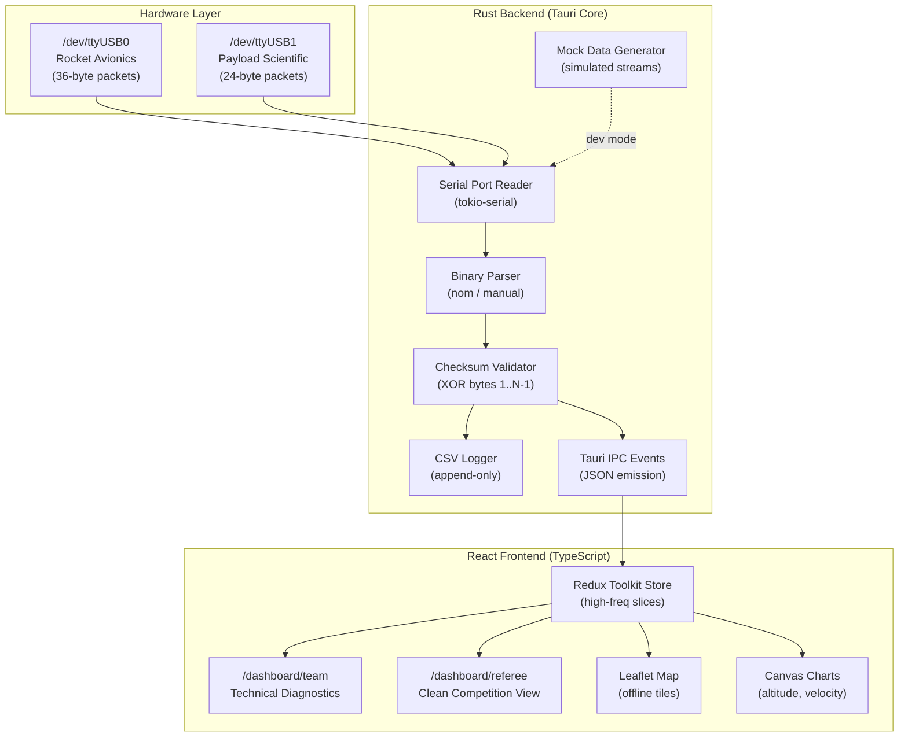
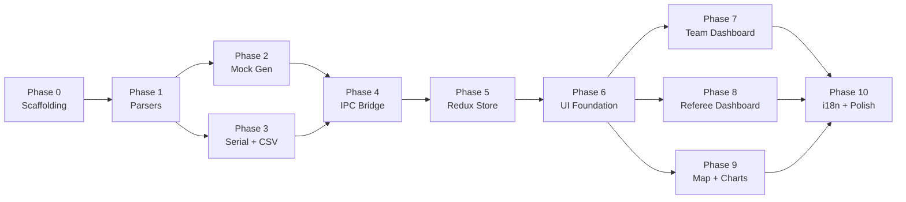

# AZST Ground Station — Architecture & Roadmap

> **TEKNOFEST A4 Rocket Competition Ground Station Software**
> Tauri (Rust + React/TypeScript) · Feature-Sliced Design · Offline-First

---

## High-Level Architecture



---

## Technology Stack

| Layer | Technology |
|-------|-----------|
| Application Framework | Tauri v2 (Rust backend + webview frontend) |
| Frontend Core | React 19 + TypeScript |
| State Management | Redux Toolkit (RTK) |
| Routing | React Router v7 |
| Styling & UI | Tailwind CSS v4 + Material UI (MUI) v7 |
| Forms & Validation | React Hook Form + Zod |
| Mapping | Leaflet (offline tiles) |
| Icons | Lucide React (no emojis) |
| i18n | i18next (en, az, tr, ru) |
| Testing | Vitest (frontend) + cargo test (Rust) |
| Target OS | Linux |

---

## Frontend Architecture (Feature-Sliced Design)

```
src/
├── app/                    # App-wide providers, routing, global styles
│   ├── App.tsx
│   ├── routes/
│   │   └── AppRoutes.tsx
│   ├── providers/
│   └── styles/
│       └── index.css       # Tailwind + design tokens
│
├── pages/                  # Route-level components
│   ├── team-dashboard/     # /dashboard/team — Engineering diagnostics
│   └── referee-dashboard/  # /dashboard/referee — Competition display
│
├── widgets/                # Composite UI blocks
│   ├── map/                # Leaflet map with offline tiles
│   ├── charts/             # Canvas-based altitude/velocity/pressure charts
│   ├── connection-panel/   # Port selector, connection controls
│   ├── packet-log/         # Virtualized raw packet feed
│   ├── avionics-summary/   # Live rocket telemetry values
│   ├── payload-summary/    # Live payload telemetry values
│   ├── system-health/      # Packet rate, errors, uptime
│   ├── flight-timeline/    # Horizontal state-machine visualization
│   ├── flight-state-hero/  # Large flight phase display (referee)
│   ├── dual-gps-panel/     # Side-by-side rocket vs payload GPS
│   └── scientific-data-panel/  # Scientific sensor sparkline
│
├── features/               # User-facing capabilities
│   ├── connection-manager/ # Serial port connection form
│   ├── packet-inspector/   # Expand raw hex view per packet
│   └── mock-controller/    # Start/stop/reset mock data
│
├── entities/               # Domain models
│   ├── rocket-packet/      # RocketAvionicsPacket + Redux slice
│   │   └── model/
│   ├── payload-packet/     # PayloadScientificPacket + Redux slice
│   │   └── model/
│   ├── connection/         # ConnectionState + Redux slice
│   │   └── model/
│   └── flight-state/       # FlightState enum + helpers
│
└── shared/                 # Cross-cutting concerns
    ├── ui/                 # Atomic components (StatusIndicator, TelemetryCard, etc.)
    ├── lib/                # Utility functions (CircularBuffer, formatters)
    ├── hooks/              # useTauriEvent, useRocketTelemetry, etc.
    ├── i18n/               # i18next config + locale JSON files
    │   └── locales/        # en.json, az.json, tr.json, ru.json
    ├── config/             # Constants (IPC events, routes, buffer sizes)
    ├── types/              # Global TypeScript interfaces
    └── test/               # Vitest setup
```

---

## Rust Backend Architecture

```
src-tauri/src/
├── lib.rs                  # Tauri app builder + plugin registration
├── main.rs                 # Binary entry point
├── protocol/               # [Phase 1] Binary parsing
│   ├── mod.rs              # Module declarations
│   ├── rocket_packet.rs    # RocketAvionicsPacket (36 bytes)
│   ├── payload_packet.rs   # PayloadScientificPacket (24 bytes)
│   ├── checksum.rs         # XOR checksum validation
│   └── tests.rs            # Exhaustive parser tests
├── mock/                   # [Phase 2] Simulated telemetry
│   ├── mod.rs
│   ├── flight_profile.rs   # Realistic ~180s flight simulation
│   └── generator.rs        # MockStream async iterator
├── serial/                 # [Phase 3] Hardware I/O
│   ├── mod.rs
│   ├── reader.rs           # tokio-serial async reader + framing
│   └── config.rs           # SerialPortConfig struct
├── logger/                 # [Phase 3] CSV persistence
│   └── csv_writer.rs       # Append-only CSV logging
└── ipc/                    # [Phase 4] Frontend communication
    ├── mod.rs
    ├── events.rs           # Tauri event emission
    └── commands.rs         # Tauri invoke commands
```

---

## Binary Data Schemas (Little-Endian)

### Rocket Avionics Packet — 36 Bytes (Stream 1)

```
Offset  Size  Type   Field
──────  ────  ────   ─────
0       1     u8     Start Byte (0xAA)
1       1     u8     Packet ID (0x01)
2-5     4     u32    Timestamp (ms)
6-9     4     f32    Altitude (m)
10-13   4     f32    Latitude
14-17   4     f32    Longitude
18-21   4     f32    Pressure 1 (hPa)
22-25   4     f32    Pressure 2 (hPa)
26-29   4     f32    Velocity (m/s)
30      1     u8     Flight State (0-5)
31      1     u8     Primary Parachute Deployed (0/1)
32      1     u8     Secondary Parachute Deployed (0/1)
33-34   2     -      Reserved/Padding
35      1     u8     Checksum (XOR of bytes 1-34)
```

### Payload Scientific Packet — 24 Bytes (Stream 2, min 5 Hz)

```
Offset  Size  Type   Field
──────  ────  ────   ─────
0       1     u8     Start Byte (0xBB)
1       1     u8     Packet ID (0x02)
2-5     4     u32    Timestamp (ms)
6-9     4     f32    Payload Latitude
10-13   4     f32    Payload Longitude
14-17   4     f32    Payload Altitude (m)
18-21   4     f32    Scientific Sensor Data
22      1     -      Reserved/Padding
23      1     u8     Checksum (XOR of bytes 1-22)
```

### Flight State Enum

| Value | State | Description |
|:-----:|-------|-------------|
| 0 | Pad | On launch pad, pre-ignition |
| 1 | Powered | Motor burning, ascending |
| 2 | Unpowered | Motor burnout, coasting |
| 3 | Apogee | Peak altitude reached |
| 4 | Primary Chute | Main parachute deployed |
| 5 | Secondary Chute | Backup parachute deployed |

---

## Phase Roadmap

### Phase 0 — Repository Scaffolding
**Goal:** Project skeleton with all tooling configured.
- Git init, Tauri v2 scaffold (React + TypeScript)
- FSD directory structure (app / pages / widgets / features / entities / shared)
- Install all dependencies (RTK, MUI, RHF+Zod, Leaflet, Lucide, i18next)
- Tailwind CSS v4 with mission-control color palette
- ESLint + Prettier + Vitest + cargo test configured
- i18n initialized with 4 locales
- Domain types defined (TypeScript side)

### Phase 1 — Rust Binary Parsers & Unit Tests
**Goal:** Core data parsing logic that every other module depends on.
- `RocketAvionicsPacket` + `PayloadScientificPacket` structs
- Little-endian field extraction (`u32`, `f32`, `u8`)
- `FlightState` enum with Serde serialization
- XOR checksum validation functions
- Exhaustive `cargo test` suite (valid round-trip, invalid checksum, wrong start byte, boundary values)

### Phase 2 — Mock Data Generator
**Goal:** Simulate realistic flight without hardware.
- ~180-second flight profile: Pad → Powered → Unpowered → Apogee → Primary Chute → Secondary Chute → Landing
- GPS coordinate drift from launch site
- Pressure inverse-correlated with altitude
- Scientific sensor: sinusoidal + noise
- Configurable tick rate (1 Hz avionics, 5 Hz payload)
- Tauri commands: `start_mock`, `stop_mock`, `reset_mock`

### Phase 3 — Serial Port Reader & CSV Logger
**Goal:** Read real hardware and persist data.
- `tokio-serial` async reader for `/dev/ttyUSB*`
- Byte-level framing (scan for start byte, accumulate, validate)
- Configurable baud rate (default 115200)
- Append-only CSV files with auto-generated headers
- Port enumeration command
- Error recovery (discard invalid frames, log corruption)

### Phase 4 — Tauri IPC Bridge
**Goal:** Stream parsed telemetry from Rust to React.
- Tauri events: `rocket-telemetry`, `payload-telemetry`, `connection-status`
- JSON serialization via `serde_json`
- Tauri commands for serial connect/disconnect, mock control, port listing
- Frontend hooks: `useTauriEvent<T>`, `useRocketTelemetry`, `usePayloadTelemetry`

### Phase 5 — Redux Store & Data Layer
**Goal:** High-frequency state without DOM thrashing.
- `rocketTelemetrySlice` — latest + rolling history (600 samples / 10 min at 1 Hz)
- `payloadTelemetrySlice` — latest + rolling history (3000 samples / 10 min at 5 Hz)
- `connectionSlice` — port status, ping, error count
- Memoized selectors (`createSelector`) per widget
- Batch dispatching via `requestAnimationFrame`
- Generic `CircularBuffer<T>` with O(1) append

### Phase 6 — Shared UI Foundation
**Goal:** Design system enforcing mission-control aesthetic.
- Color palette: deep space black (`#0a0e17`), status green (`#00ff88`), alert red (`#ff3366`), info blue (`#3399ff`), warning amber (`#ffaa00`)
- Typography: Inter (UI) + JetBrains Mono (telemetry data)
- Components: `StatusIndicator`, `TelemetryCard`, `DataTable`, `PanelContainer`, `FlightStateBadge`
- App shell: sidebar nav + top status bar + React Router layout
- Storybook stories for every component

### Phase 7 — Team Dashboard (`/dashboard/team`)
**Goal:** Deep technical diagnostics for the engineering team.
- Connection Panel (port selector, baud rate, connect/disconnect)
- Raw Packet Log (virtualized scrolling, JSON + hex view)
- Avionics Summary (altitude, velocity, pressure, flight state)
- Payload Summary (GPS, scientific data)
- System Health (packet rate, checksum failures, uptime)
- Flight Timeline (horizontal state-machine visualization)
- Mock mode toggle

### Phase 8 — Referee Dashboard (`/dashboard/referee`)
**Goal:** Clean, high-contrast display for competition judges.
- 4-quadrant grid: Flight State Hero, Dual GPS, Scientific Data, Map
- Large bold typography (readable from 3+ meters)
- Parachute deployment: full-panel green flash
- Maximum 6 data fields visible — NO debug info, NO raw hex

### Phase 9 — Offline Map & Canvas Charting
**Goal:** Trajectory and trend visualization without internet.
- Leaflet with local tile loading (`public/tiles/{z}/{x}/{y}.png`)
- Custom markers: Rocket (red), Payload (blue), Launch site (flag)
- Polyline descent trail with fade
- Canvas charts: Altitude vs Time, Velocity vs Time, Pressure vs Time
- Rolling 60-second window, scrollable

### Phase 10 — i18n, Responsiveness & Final Polish
**Goal:** Production readiness.
- All UI text extracted to translation keys (en, az, tr, ru)
- Responsive: Desktop (full), Tablet (stacked), Mobile (emergency fallback)
- Error boundaries per widget
- Loading skeletons, keyboard shortcuts
- `npm run tauri build` → Linux `.deb` / `.AppImage`

---

## Dependency Graph



> **Note:** Phases 7, 8, and 9 can run in parallel once Phase 6 is complete.

---

## Design Principles

1. **No Emojis** — Only Lucide SVG icons for all visual indicators
2. **Mission-Control Aesthetic** — Dark, utilitarian, industrial-grade
3. **Offline-First** — Map tiles and all data local, no internet required
4. **Test-Driven** — Every module has unit tests (Vitest + cargo test)
5. **Performance** — Canvas charting, circular buffers, batched Redux dispatches
6. **FSD Boundaries** — Strict layer isolation: shared → entities → features → widgets → pages → app
